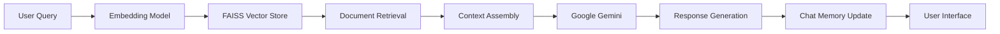

# 🚀 WriteWise - AI-Powered Appwrite Documentation Assistant

<div align="center">


[](https://writewise.streamlit.app)
[](https://python.org)
[](https://langchain.com)
[](https://ai.google.dev)

**Your intelligent companion for navigating Appwrite's documentation with ease**

[🌐 **Live Demo**](https://writewise.streamlit.app) • [📚 **Documentation**](#documentation) • [🛠️ **Installation**](#installation)

</div>

---

## 🎯 **What is WriteWise?**

WriteWise is an advanced RAG (Retrieval-Augmented Generation) chatbot designed specifically for Appwrite developers. It combines the power of Google's Gemini AI with a comprehensive knowledge base of Appwrite documentation to provide instant, contextual answers to your development questions.

### ✨ **Key Features**

- 🧠 **Intelligent Conversations**: Remembers context across questions for natural dialogue
- ⚡ **Real-time Responses**: Instant answers with beautiful typing animations
- 🔍 **Smart Document Retrieval**: Semantic search across 100+ Appwrite documentation pages
- 🎨 **Modern UI**: Glassmorphism design with Appwrite-inspired branding
- 📱 **Responsive Design**: Works perfectly on desktop and mobile
- 🌐 **Multi-topic Support**: Authentication, Databases, Functions, Storage, and more

---

## 🛠️ **Tech Stack**

| Component | Technology |
|-----------|------------|
| **Frontend** | Streamlit with custom CSS/HTML |
| **AI Model** | Google Gemini 1.5 Flash |
| **RAG Framework** | LangChain + LangGraph |
| **Vector Database** | FAISS |
| **Embeddings** | Google text-embedding-004 |
| **Deployment** | Streamlit Cloud |

---

## 🚀 **Quick Start**

### Prerequisites

- Python 3.8+
- Google API Key (for Gemini)
- Git

### Installation

1. **Clone the repository**
   ```bash
   git clone https://github.com/yourusername/writewise.git
   cd writewise
   ```

2. **Install dependencies**
   ```bash
   pip install -r requirements.txt
   ```

3. **Set up environment variables**
   ```bash
   # Create .env file
   echo "GOOGLE_API_KEY=your_google_api_key_here" > .env
   ```

4. **Prepare the vector database**
   ```bash
   # Make sure your FAISS index is in the correct location
   # ./data/faiss_index/
   ```

5. **Run the application**
   ```bash
   streamlit run lagent.py
   ```

6. **Open your browser**
   ```
   http://localhost:8501
   ```

---

## 📁 **Project Structure**

```
writewise/
├── lagent.py              # Main Streamlit application
├── query.py               # LangGraph workflow and logic
├── embedding.py           # Vector store setup
├── requirements.txt       # Python dependencies
├── .env                   # Environment variables (create this)
├── data/
│   └── faiss_index/      # FAISS vector database
└── README.md             # You are here!
```

---

## 🔧 **Configuration**

### Environment Variables

Create a `.env` file in the root directory:

```env
GOOGLE_API_KEY=your_google_gemini_api_key
```

### Streamlit Secrets (for deployment)

For Streamlit Cloud deployment, add to your secrets:

```toml
# .streamlit/secrets.toml
GOOGLE_API_KEY = "your_google_gemini_api_key"
```

---

## 💡 **How It Works**

1. **Document Ingestion**: Appwrite documentation is processed and stored in FAISS vector database
2. **Query Processing**: User questions are embedded and matched with relevant documents
3. **Context Retrieval**: Most relevant documentation sections are retrieved
4. **AI Generation**: Google Gemini generates contextual responses using retrieved documents
5. **Memory Management**: Conversation history is maintained for context-aware responses

### Architecture Diagram



---

## 🎨 **Features in Detail**

### Modern UI Design
- **Glassmorphism Effects**: Translucent elements with backdrop blur
- **Gradient Accents**: Appwrite-inspired pink and purple gradients
- **Smooth Animations**: Message slide-ins and hover effects
- **Responsive Layout**: Optimized for all screen sizes

### Intelligent Conversations
- **Context Awareness**: Remembers previous questions and answers
- **Follow-up Support**: Handles related questions naturally
- **Topic Switching**: Seamlessly transitions between different Appwrite features

### Comprehensive Knowledge Base
- Authentication & Users
- Databases & Collections
- Cloud Functions
- Storage & Files
- Messaging & Notifications
- Self-hosting & Configuration

---

## 🚀 **Deployment**

### Streamlit Cloud (Recommended)

1. Fork this repository
2. Connect to Streamlit Cloud
3. Add your `GOOGLE_API_KEY` to secrets
4. Deploy automatically

### Local Deployment

```bash
# Install dependencies
pip install -r requirements.txt

# Set environment variables
export GOOGLE_API_KEY="your_api_key"

# Run the app
streamlit run lagent.py
```

---

## 🤝 **Contributing**

We welcome contributions! Here's how you can help:

1. **Fork the repository**
2. **Create a feature branch**: `git checkout -b feature/amazing-feature`
3. **Commit your changes**: `git commit -m 'Add amazing feature'`
4. **Push to the branch**: `git push origin feature/amazing-feature`
5. **Create a Pull Request**

### Development Setup

```bash
# Clone your fork
git clone https://github.com/yourusername/writewise.git

# Create virtual environment
python -m venv venv
source venv/bin/activate  # On Windows: venv\Scripts\activate

# Install in development mode
pip install -r requirements.txt
```

---

## 📊 **Performance**

- **Response Time**: ~2-3 seconds average
- **Knowledge Base**: 100+ Appwrite documentation pages
- **Vector Dimensions**: 768 (Google text-embedding-004)
- **Memory Limit**: Last 4 conversation exchanges for context

---

## 🐛 **Troubleshooting**

### Common Issues

**FAISS Index Not Found**
```bash
# Ensure the FAISS index exists in the correct location
ls -la data/faiss_index/
```

**Google API Key Issues**
```bash
# Check if your API key is set
echo $GOOGLE_API_KEY
```

**Memory Issues**
```bash
# Clear Streamlit cache
streamlit cache clear
```

---

## 📄 **License**

This project is licensed under the MIT License - see the [LICENSE](LICENSE) file for details.

---

## 🙏 **Acknowledgments**

- **Appwrite Team** for the amazing BaaS platform and comprehensive documentation
- **Google AI** for the powerful Gemini models and embedding APIs
- **LangChain** for the excellent RAG framework
- **Streamlit** for the fantastic web app framework

---

## 📞 **Support**

- **Live Demo**: [writewise.streamlit.app](https://writewise.streamlit.app)
- **Issues**: [GitHub Issues](https://github.com/OsasDTech/writewise/issues)
- **Discussions**: [GitHub Discussions](https://github.com/OsasDTech/writewise-os/discussions)

---

<div align="center">

**Built with ❤️ for the Appwrite developer community**

[](https://github.com/OsasDTech/writewise)
[](https://twitter.com/osasgentech)

</div>
